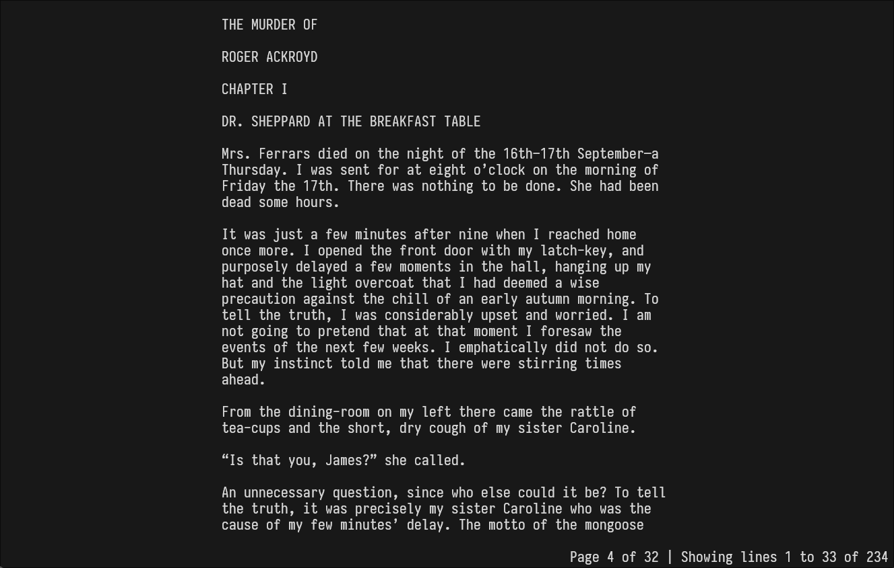
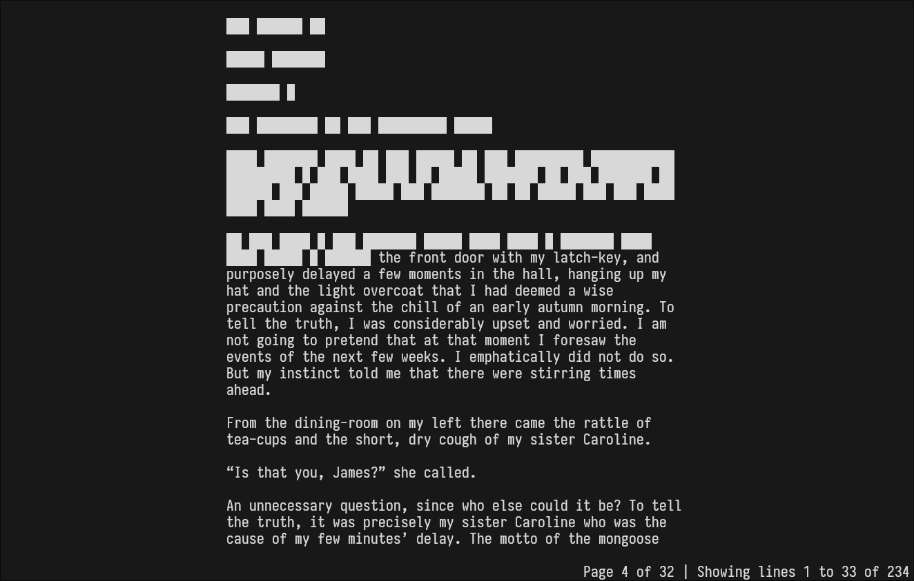

# Lire

> Lire /ˈlaɪ(ə)r/: to read




## Features

- **EPUB Parsing:** Reads and extracts text from EPUB files.
- **Navigation:** Scroll through the text with arrow keys or `j/k` keys, jump by pages, and navigate between chapters.
- **Text Redaction:** Manually blank out words you already read to keep track of progress.

## Key Bindings

- `UP` / `k`: Scroll up one line.
- `DOWN` / `j`: Scroll down one line.
- `LEFT` / `h`: Go to the previous chapter.
- `RIGHT` / `l`: Go to the next chapter.
- `f`: Scroll forward one page.
- `b`: Scroll backward one page.
- `n`: Move the redaction boundary forward (hiding one word).
- `p`: Move the redaction boundary backward (Revealing last redacted word).
- `SPACE`: Toggle redaction on/off.
- `P`: Reset the redaction boundary.
- `q`: Quit the reader.

## Requirements

- Python 3.6+
- Required Python packages:
  - `ebooklib`
  - `beautifulsoup4`
  - `argparse` (built-in module in most Python3 distributions)
  - `curses` (built-in module in most Python distributions)

## Usage

Run the program with the following command:

``` sh
./lire <path_to_epub_file>
```
